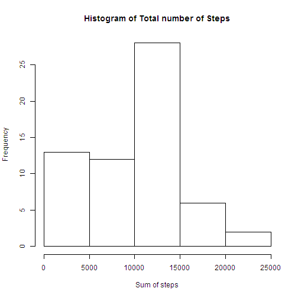
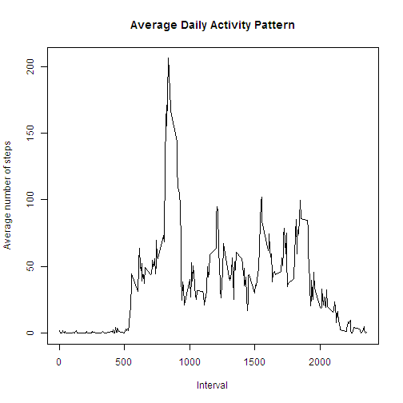
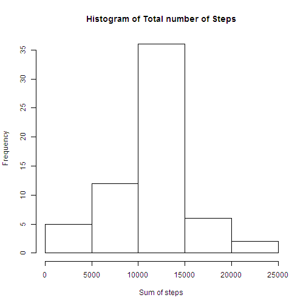
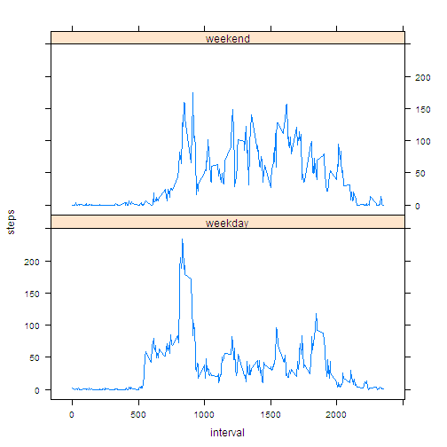

Reproducible Research: Peer Assessment 1
===============================


### Loading and preprocessing the data


```r
activity <- read.csv("activity.csv")
activity$date <- as.Date(activity$date, "%Y-%m-%d")
```

### What is mean total number of steps taken per day?
1. Make a histogram of the total number of steps taken each day


```r
sumStepsByday <- aggregate(steps~date,activity,sum,na.action=NULL,na.rm=T)
hist(sumStepsByday$steps,main="Histogram of Total number of Steps",xlab="Sum of steps")
```

 

2. Calculate and report the mean and median total number of steps taken per day 


```r
sumSteps <- aggregate(steps~date,activity,sum,na.action=NULL,na.rm=T)
summary(sumSteps$steps)
```

```
##    Min. 1st Qu.  Median    Mean 3rd Qu.    Max. 
##       0    6778   10400    9354   12810   21190
```

### What is the average daily activity pattern?
1. Make a time series plot (i.e. type = "l") of the 5-minute interval (x-axis) and the average number of steps taken, averaged across all days (y-axis)


```r
plot(aggregate(steps~interval,activity,mean),type="l",main="Average Daily Activity Pattern",ylab="Average number of steps",xlab="Interval")
```

 

2. Which 5-minute interval, on average across all the days in the dataset, contains the maximum number of steps?


```r
dfsi <- aggregate(steps~interval,activity,mean)
dfsi$interval[which(dfsi$steps==max(dfsi$steps))]
```

```
## [1] 835
```

### Imputing missing values

1. Calculate and report the total number of missing values in the dataset (i.e. the total number of rows with NAs)


```r
nrow(activity[is.na(activity$steps),])
```

```
## [1] 2304
```

2. Devise a strategy for filling in all of the missing values in the dataset. The strategy does not need to be sophisticated. For example, you could use the mean/median for that day, or the mean for that 5-minute interval, etc.


```r
#get the stanard deviation of the average steps for each day and round it off with no decimal place
round(sd(aggregate(steps~interval,activity,mean)$steps),0)
```

```
## [1] 39
```

3. Create a new dataset that is equal to the original dataset but with the missing data filled in.


```r
#clone the original dataset and use the the strategy to replace the NAs with the new value
activityFilledNA <- activity
activityFilledNA[is.na(activityFilledNA)] <- round(sd(aggregate(steps~interval,activity,mean)$steps),0)
```

4. Make a histogram of the total number of steps taken each day and Calculate and report the mean and median total number of steps taken per day. Do these values differ from the estimates from the first part of the assignment? What is the impact of imputing missing data on the estimates of the total daily number of steps?


```r
sumStepsBydayNoNA <- aggregate(steps~date,activityFilledNA,sum,na.action=NULL)
hist(sumStepsBydayNoNA$steps,main="Histogram of Total number of Steps",xlab="Sum of steps")
```

 

```r
summary(sumStepsBydayNoNA$steps)
```

```
##    Min. 1st Qu.  Median    Mean 3rd Qu.    Max. 
##      41    9819   11230   10830   12810   21190
```

### Are there differences in activity patterns between weekdays and weekends?

1. Create a new factor variable in the dataset with two levels - "weekday" and "weekend" indicating whether a given date is a weekday or weekend day.


```r
activity$weektype <- ifelse(weekdays(activity$date)=="Saturday" | weekdays(activity$date)=="Sunday","weekend","weekday")
activity$weektype <- as.factor(activity$weektype)
```

2. Make a panel plot containing a time series plot (i.e. type = "l") of the 5-minute interval (x-axis) and the average number of steps taken, averaged across all weekday days or weekend days (y-axis). 


```r
library(lattice)
dff <- aggregate(steps~interval+weektype,activity,mean)
xyplot(steps~interval | weektype,data=dff,layout=c(1,2),type="l")
```

 
